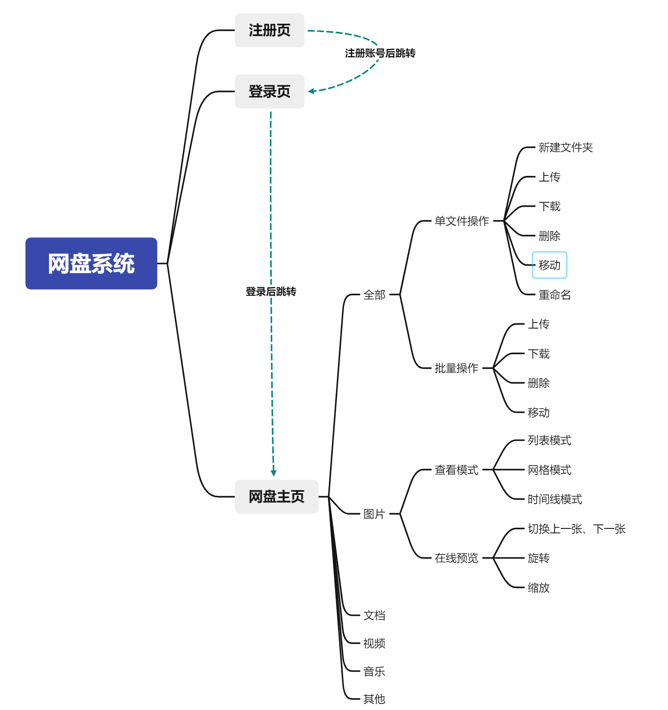
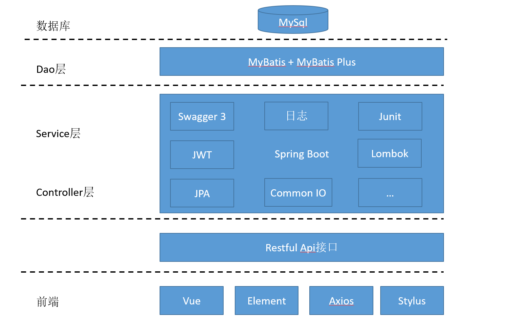

# 前后端分离网盘系统

在数据时代，我们每天都在互联网上生成大量数据，同时也接收着大量数据。随着图片、音乐、影视、课程越来越多，不管是手机、iPad 还是电脑，空间根本不够用，所以很多人会把文件存在各种网盘里。因而网盘项目一直以来都是一个笔记热门的话题，每个人都希望能够拥有自己的网盘。本项目将使用 Spring Boot 和 Vue 这两个热门开源框架，搭建一个网盘项目。

## 项目简介

### 定位

采用前后端分离的模式来开发 Web 端网盘系统，具有用户注册、登录功能，单个和批量操作文件的功能。

### 特色

1.  使用前后端分离的模式搭建工程，开发系统，使开发者能够各司其职。
2.  后台使用业内目前最流行的 Spring Boot2 作为基础框架开发，集成优秀开源项目 Knife 使前端开发者可浏览和调试接口文档。
3.  前端使用 Vue.js 框架及其生态，结合 Element UI 组件库开发页面，编写功能。

### 项目架构

#### 项目结构图

#### 技术架构图

